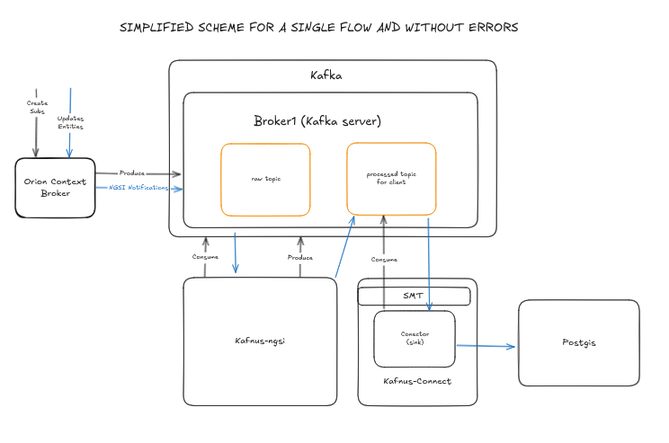
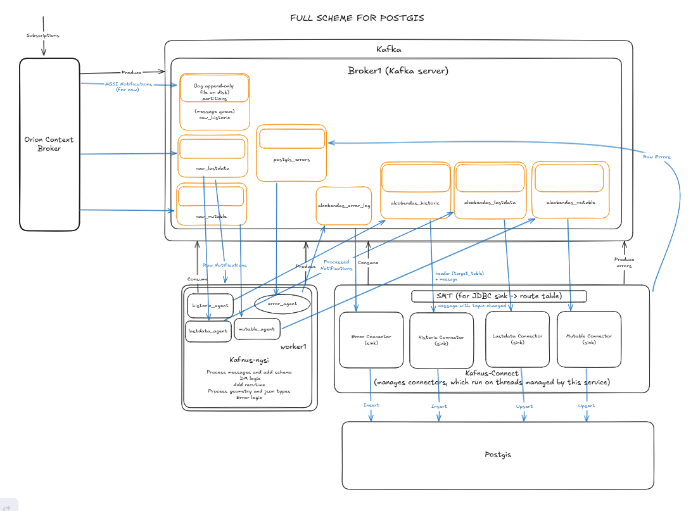

# 🏗️ Architecture Overview

This document describes the high-level architecture of Kafnus, a Kafka-based stream processing and persistence platform for smart city NGSI notifications.

---

## 🗺️ Conceptual Flow

The system is designed to replace Cygnus in FIWARE-based environments, introducing a modern, Kafka-native architecture. The key stages are:

1. **Ingestion**
2. **Stream Processing**
3. **Persistence**
4. **Monitoring**

The system supports multiple data flows (`historic`, `lastdata`, `mutable`) and both **PostGIS** and **MongoDB** sinks.

---

## 🔄 End-to-End Flow Description

1. **CB → Kafka**  
   NGSIv2 notifications are published directly from the Context Broker to Kafka raw topics.

2. **Kafka → Kafnus NGSI**  
   Kafnus NGSI processor consumes messages from `raw_historic`, `raw_lastdata`, and `raw_mutable`. Each flow is handled by a dedicated agent. Processing includes:
   - Enrichment (`recvtime`)
   - Conversion of `geo:*` fields to WKB
   - Schema construction
   - Header setting for routing

3. **Kafnus NGSI → Kafka**  
   Processed events are emitted to new Kafka topics (`<service>`, `<service>_lastdata`, etc.) along with a header (`target_table`) indicating the intended DB table.

4. **Kafka → Kafnus Connect → DB**  
   Kafnus Connect sink connectors (JDBC or MongoDB) persist messages into the appropriate database tables. A custom SMT (`HeaderRouter`) rewrites the topic name from the Kafka header.

---

## 🖼️ Architecture Diagrams

### Simplified View

This image shows the core data path for a single flow:

> 📝 **Edit source**: You can view and modify the diagram using [Excalidraw](https://excalidraw.com/#room=e06782c4fdd1d900246a,f_sdKK90w0FsFWKnDWsYmw).

### Full View (PostGIS)

Detailed diagram showing all services and flows in the PostGIS variant:

> 📝 **Edit source**: You can view and modify the diagram using [Excalidraw](https://excalidraw.com/#room=e06782c4fdd1d900246a,f_sdKK90w0FsFWKnDWsYmw).

---

## 🧩 Component Overview

### 🚪 Ingestion

- **Context Broker (CB)**: Directly notifies Kafka with NGSIv2 events.
- **Input topics**: 
   - `raw_historic`
   - `raw_lastdata`
   - `raw_mutable`

### 🧠 Processing – Kafnus NGSI

- Written in Node.js (previously Python/Faust, now deprecated)
- Processes raw NGSIv2 notifications
- Applies logic per flow:
  - `historic`: all events
  - `lastdata`: deduplicated by `TimeInstant`
  - `mutable`: allows field overwrite
- Sets Kafka headers like `target_table`
- Produces to dynamic topics (`{service}[_{flow}]`)

### 🛢️ Persistence – Kafnus Connect

- **JDBC Connector** (with PostGIS geometry support)
- **MongoDB Connector**
- **Custom SMT (`HeaderRouter`)** rewrites topic name from header

Kafnus Connect configurations are defined in JSON files under `sinks/`.

---

## 🏗️ Extensibility

- Easy to add new flows by defining new Kafnus NGSI agents.
- Flexible topic-to-table mapping via Kafka headers and SMT.
- Kafnus Connect sink configuration is modular (JSON files).
- MongoDB pipeline can evolve independently.

---

## 🧭 Navigation

- [⬅️ Previous: Installation](/doc/01_installation.md)
- [🏠 Main index](../README.md#documentation)
- [➡️ Next: Operational-Guide](/doc/03_operational_guide.md)