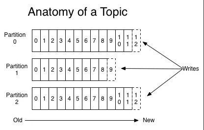
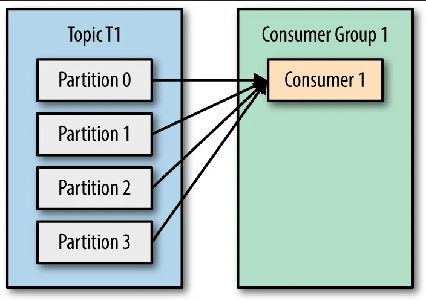
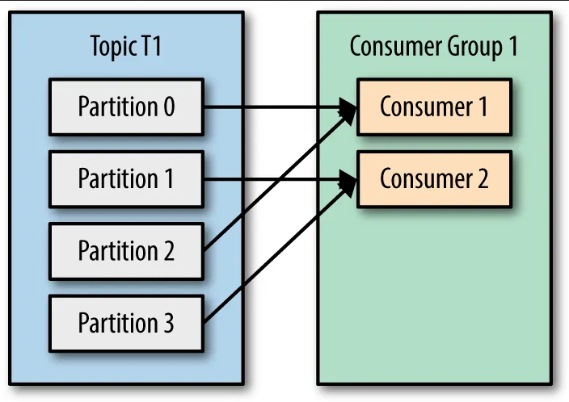
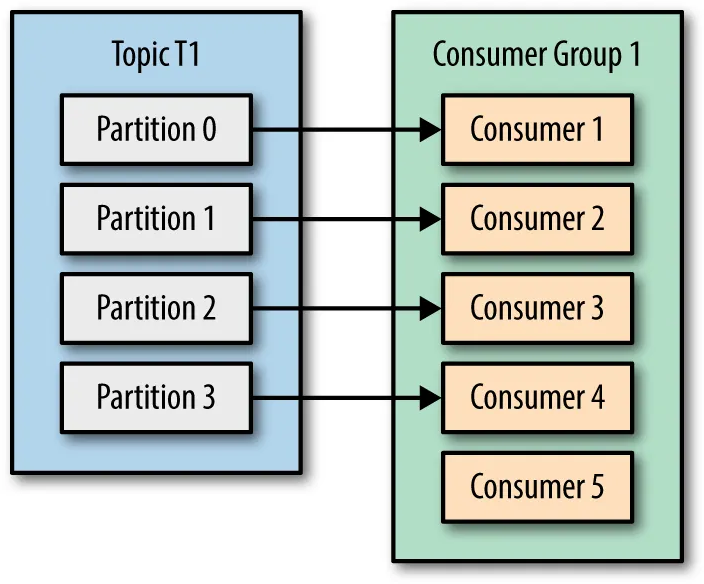
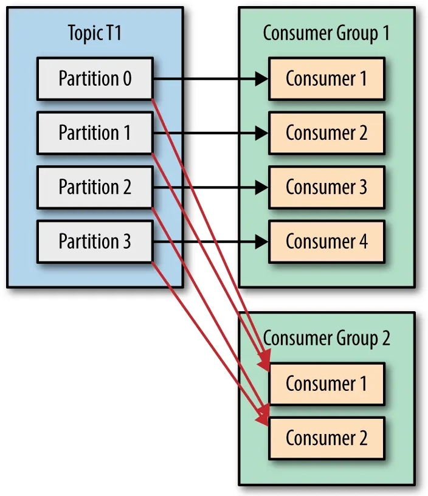
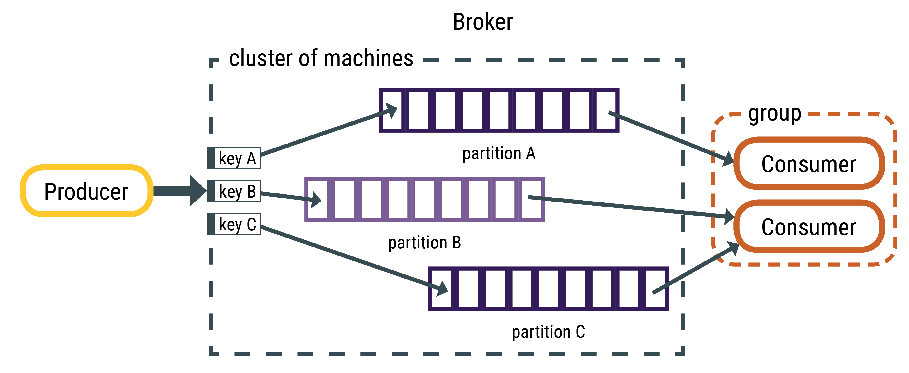
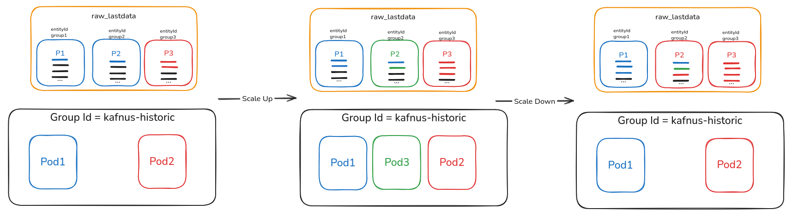

# ⚖️ Scaling Kafka and Kafnus NGSI

This document explains the fundamental principles behind scaling Kafka and Kafnus NGSI stream processors. It focuses on how Kafka topics, partitions, and consumer groups interact, and how this impacts performance, throughput, and horizontal scalability in the context of smart city deployments using FIWARE.

---

## 🧠 Core Concepts

### 📦 Kafka Topics and Partitions

A **Kafka topic** is a logical channel where events (messages) are published. Each topic is split into one or more **partitions**, which are the unit of parallelism in Kafka.

- A **partition** is an ordered, append-only log of records.
- A topic with multiple partitions enables multiple consumers to process data in parallel.
- Partitions are **immutable and sequential**, meaning Kafka guarantees order **within a partition**, but not across partitions.

> ✅ A topic must be defined with enough partitions if we expect to scale its processing workload.



---

### 🧑‍🤝‍🧑 Kafka Consumers, Groups, and Parallelism

Kafka enables parallel data processing through **topic partitions** and **consumer groups**. This is the foundation for horizontal scalability in Kafnus NGSI.

---

#### 🔁 How it works

- A **Kafka topic** is split into one or more **partitions**.
- Each **consumer** in a **consumer group** is assigned one or more partitions.
- A **partition is always read by only one consumer** in the group.
- Kafka distributes partitions **automatically** among available consumers.

📌 Kafka ensures **message order within a partition**, but not across partitions.

---

#### 🔢 Distribution Scenarios

| Partitions | Consumers | Distribution                        |
|------------|-----------|-------------------------------------|
| 4          | 2         | Each consumer gets 2 partitions     |
| 4          | 4         | Each consumer gets 1 partition      |
| 4          | 6         | Only 4 consumers are active, 2 idle |

> ⚠️ The number of **active consumers** cannot exceed the number of **partitions**.

---

#### 🖼️ Visual Examples

These diagrams illustrate how Kafka assigns partitions depending on the number of consumers:

1. One consumer group with one consumer  
   

2. One consumer group with just enough consumers  
   

3. One consumer group with too many consumers  
   

4. Two consumer groups with multiple consumers (partitions are read two times)
   

---

## 🔀 Message Distribution and Multi-Agent Processing

In a Kafka-based architecture like Kafnus, achieving effective horizontal scaling depends not only on the number of partitions or consumers but also on how messages are distributed and how processing is organized. This section explains two key aspects that enable scalability and consistency: **partitioning by key**, and **multi-agent stream processing**.

---

### 🧩 Key-Based Message Distribution

Kafka distributes incoming messages to topic partitions based on their **key**. This key determines which partition a message will land in.

> ⚠️ If no key is provided, messages are distributed randomly — which may lead to poor locality or inconsistent processing.

In the context of Kafnus:

- Each incoming NGSI notification should ideally use the **entity ID (`entityid`) as the Kafka message key**.
- This ensures that all updates for a single entity go to the **same partition**, preserving **message ordering** for that entity (**IMPORTANT for lastdata**).
- Proper partitioning enables **parallel processing across entities**, while maintaining consistency **within** each entity's data stream.

📌 **If all messages go to the same partition (e.g., due to missing keys)**, no matter how many consumers or pods are deployed, **only one will be active**. This creates a bottleneck.



Another useful example can be found [here](../doc/images/ProducerMesssageKeys.png).

---

### 🧠 Multi-Agent Stream Processing in Kafnus

Kafnus NGSI is organized into multiple **agents**, each dedicated to processing a specific type of NGSI data flow. This modular design improves scalability, clarity, and control.

| Agent        | Input Topic        | Output Topic(s)         | Purpose                         |
|--------------|--------------------|--------------------------|----------------------------------|
| `historic`   | `raw_historic`     | `<service>`              | Store full historical records   |
| `lastdata`   | `raw_lastdata`     | `<service>_lastdata`     | Store latest entity state       |
| `mutable`    | `raw_mutable`      | `<service>_mutable`      | Allow overwrites / updates      |
| `errors`     | `raw_errors`       | `<db>_error_log`         | Reconstruct and log DB errors   |

Each agent:

- Runs independently and listens to its own topic.
- Applies logic specific to the flow it handles.
- Sends output to dynamically generated processed topics, routed by headers.

---

### 🧠 Why Per-Agent Processing Matters

#### ✅ Independent Scaling
Each agent can be deployed and scaled independently:

- `historic` agent may require more throughput (more partitions, more pods).
- `errors` agent may only need a single replica.

#### ✅ Isolated Logic
Each agent encapsulates its transformation logic. For example:

- `historic` always includes `TimeInstant` in the primary key.
- `lastdata` compares timestamps to store only the latest known version.
- `errors` parses Kafka Connect failure records into structured logs.

---

### ⚠️ Ordering Guarantees in `lastdata`

The `lastdata` agent requires **strict ordering by `TimeInstant`** to ensure only the most recent update is retained. To achieve this:

- All messages for a given entity **must be processed in order**.
- Kafka guarantees ordering **within a partition** only.
- Therefore, **all messages for the same entity must land in the same partition**.

✅ This is achieved by **using `entityid` as the Kafka key**.

> ❌ If updates for the same entity are spread across partitions, one consumer may process an old timestamp **after** another has already written a newer one — leading to **data inconsistency**.

---

### 🧠 Implications for Node.js Migration

When migrating from Python (Faust) to Node.js (`@confluentinc/kafka-javascript`):

- The per-agent architecture should be preserved.
- Each agent becomes a **separate consumer process** or **worker module**.
- Each agent subscribes to a specific topic and applies dedicated logic.
- Message keys and partitioning logic **must match** the current design to preserve behavior.

---

## 🚀 Scaling Strategies

### Python (Faust) and Node.js (`@confluentinc/kafka-javascript`)

Both the legacy Python version and the new Node.js version support **horizontal scaling**.

#### Development Environment (Docker)

- You can use a single container with multiple **threads or processes**.
- In Faust, you can use `--concurrency=4` to enable parallel processing.
- This works well for local development and testing.

---

### 🏗️ Production Environment (Kubernetes)

In production, the recommended approach for scaling `kafnus-ngsi` is to:

- Set `--concurrency=1` (for Python/Faust) so that each **pod runs as a single consumer**.
- Use **multiple pods (replicas)** to scale horizontally.
- Use a **shared consumer group** per agent (e.g., `ngsi-agent-historic`) so Kafka can **distribute partitions**.

> 🧠 The number of Kafka **topic partitions should be ≥ number of pods** to ensure effective parallelism.

#### 🔁 Consumer Group Distribution

When all pods share the **same `group.id`**, Kafka distributes topic partitions across them:



- **Same group ID ➔ cooperative consumers**  
  All pods act as a single consumer group, so **each partition is assigned to only one pod at a time**. This prevents duplicate processing.

- **Automatic rebalancing**  
  When pods are added or removed (scaling up or down), Kafka automatically **rebalances partitions** across the active pods to distribute the load as evenly as possible.

- **Offset retention**  
  When a partition moves from one pod to another, the new pod **continues reading from the last committed offset**, so no data is lost or processed twice.

- **Number of partitions = max active pods**  
  To achieve maximum parallelism, you should ensure the **number of topic partitions is greater than or equal to the maximum number of pods** you plan to scale up to. Extra pods beyond the number of partitions will remain idle.

- **Order guarantees within a partition**  
  Kafka guarantees **message order only within a partition**, so to preserve correct ordering for a given key (e.g., `entityid`), make sure **all messages for that key are routed to the same partition**.

---

### Java-based kafnus-ngsi

If using a Java version (e.g., Kafka Streams or custom implementation), the recommendation is:

- Prefer **vertical scaling** (increase CPU & RAM).
- Keep a **single replica**, since Java threading model allows efficient in-process parallelism.
- Use multiple threads internally to handle partitions.

---

## 📐 Partitioning Guidelines

When defining Kafka topics (e.g., `raw_historic`, `raw_lastdata`, `raw_mutable`), consider:

- Initial number of partitions per topic: **4–8** (adjustable later).
- Use Kafka metrics (consumer lag, throughput) to decide when to **increase partitions**.
- Be aware that **increasing partitions after deployment requires careful handling**, especially if using upsert logic or ordering-sensitive workflows.

---

## 📈 Autoscaling Example (Kubernetes)

Although Kubernetes is not the only deployment target, here’s a brief autoscaling setup for reference:

```yaml
apiVersion: autoscaling/v2
kind: HorizontalPodAutoscaler
metadata:
  name: kafnus-ngsi-hpa
spec:
  scaleTargetRef:
    apiVersion: apps/v1
    kind: Deployment
    name: kafnus-ngsi
  minReplicas: 1
  maxReplicas: 6
  metrics:
  - type: Resource
    resource:
      name: cpu
      target:
        type: Utilization
        averageUtilization: 70
```

---

## ✅ Summary

### 🔧 Component Scaling Overview

| Component             | Scale Type   | Strategy                            |
|----------------------|--------------|-------------------------------------|
| Kafka Topics          | Horizontal   | Increase partitions                 |
| kafnus-ngsi (Python)  | Horizontal   | More pods (`--concurrency=1`)       |
| kafnus-ngsi (Node.js) | Horizontal   | More pods, 1 process per partition  |
| kafnus-ngsi (Java)    | Vertical     | More CPU/RAM per instance, threads  |

---

### 📐 Key Principles for Scalability and Consistency

| Principle                         | Why It Matters                                                                 |
|----------------------------------|--------------------------------------------------------------------------------|
| **Partition-per-entityid**       | Ensures per-entity ordering and parallelism                                   |
| **One consumer per partition**   | Prevents duplicated processing and guarantees consistency                     |
| **Consumer groups**              | Enable pods to share load while reading different partitions                  |
| **Agent separation**             | Lets each NGSI flow scale independently and isolate logic                     |
| **Offset retention**             | Allows new pods to resume processing where others left off after rebalance    |
| **Min partitions ≥ max replicas**| Ensures all pods are utilized when scaling up                                 |
| **Kafka handles rebalance**      | When pods are added/removed, Kafka redistributes partitions automatically     |
| **Preserve ordering in lastdata**| Prevents outdated state overrides by ensuring entity updates are sequential   |
| **No key = random partition**    | Can break consistency and block horizontal scaling                            |

---


## 🧭 Navigation

- [⬅️ Previous: Testing](/doc/08_testing.md)
- [🏠 Main index](../README.md#documentation)